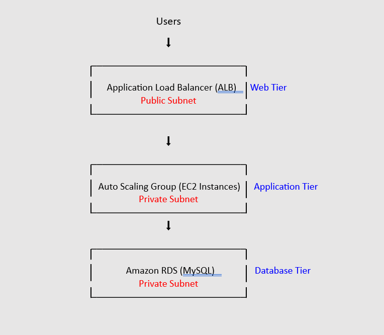
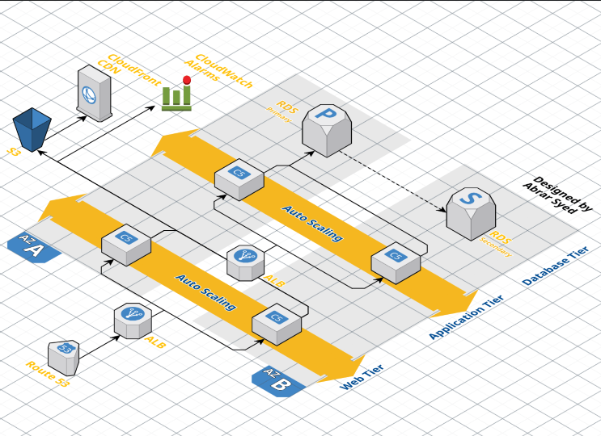
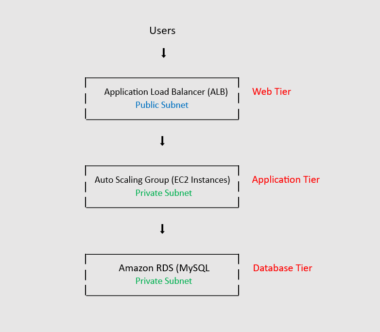

# Multi-Tier Architecture on AWS

🚀 A scalable and fault-tolerant AWS architecture using EC2, ALB, RDS, and Auto Scaling.

## 🌟 Features
- Load Balancing with ALB
- Auto Scaling for high availability
- Secure RDS database
- CloudWatch for monitoring

## 📖 Detailed Project Steps
Find the full implementation guide in [docs/project_steps.md](docs/project_steps.md).

## 📸 Architecture Diagram

🔗 [View the full project documentation](docs/project_steps.md)
