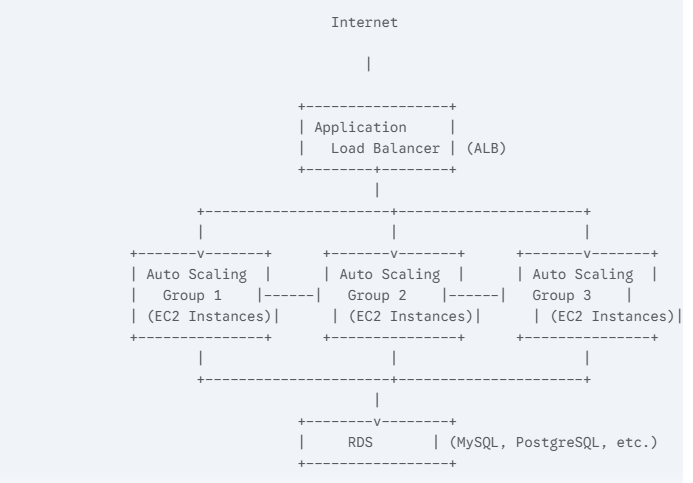
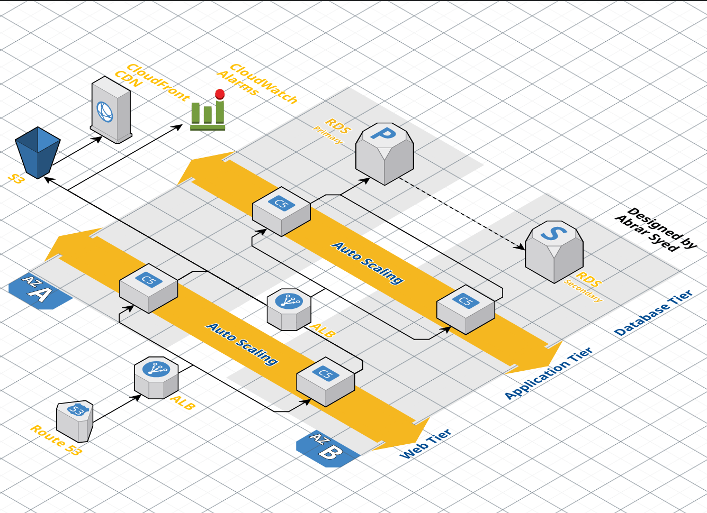
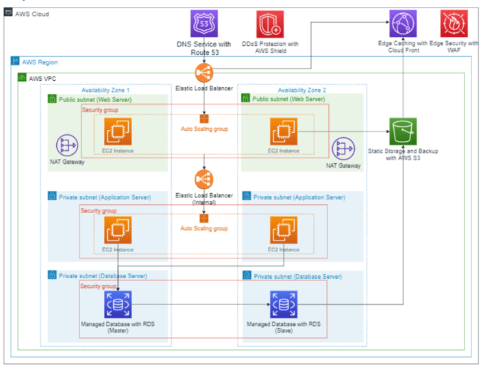

# Multi-Tier Architecture on AWS

## 🚀 Project Overview
This project showcases the design and implementation of a highly scalable and reliable **multi-tier architecture** on AWS. It uses an **Application Load Balancer (ALB)** to distribute traffic, **EC2 instances** for compute, **Auto Scaling** for elasticity, **RDS** for a managed database solution, and **CloudWatch** for monitoring and alerting.

---
## 🏗 Architecture Overview (3-Tier)

### **1️⃣ Application Load Balancer (Public Subnet)**
Handles traffic distribution and improves fault tolerance.

                         ⬇️

### **2️⃣ Application Layer (EC2 + Auto Scaling)**
Contains the application servers running on EC2 instances. Instances are automatically scaled based on traffic demand.

                         ⬇️

### **3️⃣ Data Layer (Amazon RDS)**
Amazon Relational Database Service stores and manages data securely.

---
## 🌟 Key Features
- **🔄 Load Balancing**: Used an **Application Load Balancer (ALB)** to ensure high availability and distribute traffic evenly.
- **📈 Scalability**: Configured **Auto Scaling** to dynamically scale EC2 instances based on traffic patterns.
- **📊 Monitoring**: Set up **CloudWatch** for logging, monitoring, and alerting on performance metrics.
- **🔒 Secure Communication**: Configured **HTTPS** using an SSL certificate via **AWS Certificate Manager (ACM)** for secure traffic.

---
## 🛠 Tech Stack
- **AWS Services**: EC2, ALB, Auto Scaling, RDS (MySQL), CloudWatch, ACM
- **Database**: MySQL (Amazon RDS)
- **Backend**: Node.js
- **Frontend**: HTML5, CSS3, JavaScript

---
## 📜 Project Workflow
1. **Frontend Tier**: The client-facing web application hosted on EC2 instances, accessed via the ALB.
2. **Backend Tier**: Application logic runs on EC2 instances connected to the RDS database.
3. **Database Tier**: Amazon RDS provides a scalable, managed database solution.
4. **Monitoring and Alerts**: CloudWatch monitors performance and sends alerts for resource utilization or errors.

---
## ⚙️ Implementation Steps
### **1️⃣ EC2 Instances for Web and App Tiers**
- Launched **EC2 instances** and configured security groups for **SSH** and **ALB traffic**.
- Installed **Node.js backend** and frontend application components.

### **2️⃣ Application Load Balancer (ALB)**
- Created an **ALB** and registered EC2 instances as target group members.
- Configured **HTTPS using ACM** for secure communication.

### **3️⃣ Auto Scaling for High Availability**
- Configured **Auto Scaling groups** for EC2 instances.
- Set scaling policies (**CPU utilization threshold, schedule-based scaling**).

### **4️⃣ RDS Setup for Database Tier**
- Provisioned an **RDS instance with MySQL**.
- Configured **subnet groups** and set up **Multi-AZ** for fault tolerance.
- Connected the **application layer** to the database.

### **5️⃣ Monitoring and Alerts with CloudWatch**
- Enabled **CloudWatch metrics** for **EC2, ALB, and RDS**.
- Created **dashboards** to visualize metrics like **CPU utilization, database connections, and response time**.
- Set up **CloudWatch alarms** for resource utilization spikes or health check failures.

---
## 🚧 Challenges and Solutions
| Challenge | Solution |
|-----------|----------|
| Handling sudden spikes in traffic | Configured **Auto Scaling** to respond dynamically to CPU utilization. |
| Secure communication between the client and application | Used **AWS ACM** for **SSL certificate management** and enforced **HTTPS** on the ALB. |
| Database high availability and backups | Configured **RDS with Multi-AZ** and enabled **automated backups**. |

---
## 🎯 Learnings and Impact
- Learned to **design and deploy** a fault-tolerant, scalable, and secure architecture on AWS.
- Gained hands-on experience with key AWS services like **ALB, Auto Scaling, and CloudWatch**.
- Built a **production-grade solution** suitable for real-world applications.

---
## 📸 Architecture Diagram

